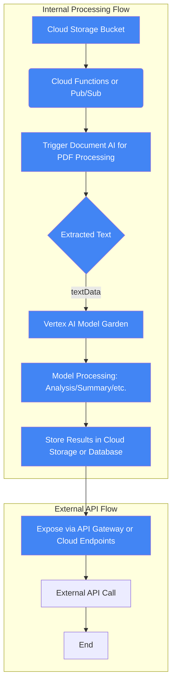

## Using Codespaces

Codespaces provides a complete, configurable dev environment on top of a powerful VM in minutes. This allows you to work on your project from anywhere, without having to clone or sync your project locally.

To use Codespaces:

1. Click on the `Code` button in your GitHub repository.
2. Select `Open with Codespaces`.
3. Click on `+ New codespace`.

## Using Terminal to Login to gcloud and Switch Projects

Before running the `setup.sh` script, you need to login to gcloud and switch to your desired project. Here's how you can do it:

1. Open the terminal in your codespace.
2. Login to gcloud by running `gcloud auth login`. Follow the prompts to authorize gcloud to use your Google Cloud account.
3. Switch to your desired project by running `gcloud config set project PROJECT_ID`, replacing `PROJECT_ID` with your actual project ID.

## Running the setup.sh Script

After logging in to gcloud and switching projects, you can run the `setup.sh` script. This script performs setup operations for your project, such as setting up Google Cloud Storage permissions.

To run the `setup.sh` script:

1. In the terminal, navigate to the directory containing the `setup.sh` script.
2. Run the script by typing `./setup.sh`.
3. The script will echo "Environment setup completed successfully." when it finishes running.

Please note that you need to have the necessary permissions to run the `setup.sh` script and to perform the operations it contains.

