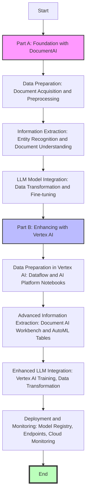

# Enhancing Foundation LLM Models with Domain-Specific Information

This document outlines a comprehensive approach for enhancing foundational Large Language Models (LLM) with business domain-specific information extracted from public PDF documents. The process is divided into two parts: leveraging Google Cloud's Document AI for initial enhancements, followed by further enrichment and integration using Vertex AI services.

## Table of Contents

- [Part A: Foundation Enhancement with DocumentAI](#part-a-foundation-enhancement-with-documentai)
  - [1. Data Preparation](#1-data-preparation)
  - [2. Information Extraction with DocumentAI](#2-information-extraction-with-documentai)
  - [3. LLM Model Integration](#3-llm-model-integration)
  - [Additional Considerations](#additional-considerations)
- [Part B: Vertex AI Specific Solution](#part-b-vertex-ai-specific-solution)
  - [1. Data Preparation in Vertex AI](#1-data-preparation-in-vertex-ai)
  - [2. Information Extraction with DocumentAI](#2-information-extraction-with-documentai-1)
  - [3. LLM Model Integration](#3-llm-model-integration-1)
  - [4. Model Deployment and Monitoring](#4-model-deployment-and-monitoring)
- [Tools and Services](#tools-and-services)
- [Benefits of This Approach](#benefits-of-this-approach)
- [Additional Considerations](#additional-considerations-1)

## Part A: Foundation Enhancement with DocumentAI

### 1. Data Preparation

**Document Acquisition**: Utilize public document sources relevant to your business domain, including web scraping and open data repositories, ensuring compliance with website terms of service.

**Document Preprocessing**: Leverage Document AI's functionalities for:
- Optical Character Recognition (OCR) to extract text from scanned PDFs.
- Form Understanding to identify pre-defined form structures.
- Additional cleaning steps such as removing headers, footers, and normalizing text.

### 2. Information Extraction with DocumentAI

Develop a custom Document AI model to recognize and extract business entities (company names, locations, financial figures) and understand document structures (e.g., financial reports) for information retrieval.

### 3. LLM Model Integration

Transform the extracted information into a format suitable for LLM training, including text corpora creation and specific task crafting, followed by model fine-tuning to learn domain-specific terminology and improve task performance.

### Additional Considerations

Ensure data quality, select an appropriate LLM foundation model, and continuously monitor the model's performance on relevant benchmarks.

## Part B: Vertex AI Specific Solution

### 1. Data Preparation in Vertex AI

Use Dataflow for ingesting PDF documents and AI Platform Notebooks for data cleaning and pre-processing tasks, including text normalization and boilerplate text removal.

### 2. Information Extraction with DocumentAI

Employ the Document AI Workbench for training custom models and AutoML Tables for structured document processing within Vertex AI.

### 3. LLM Model Integration

Utilize Vertex AI Training for model fine-tuning with support for popular deep learning frameworks, followed by data transformation to prepare domain-specific training material.

### 4. Model Deployment and Monitoring

Store the trained model in Vertex Model Registry, deploy it through Vertex Endpoints, and set up Cloud Monitoring to ensure effective performance and identify issues timely.

## Tools and Services

- Document AI: https://cloud.google.com/document-ai
- Vertex AI: https://cloud.google.com/vertex-ai
- Additional tools include Cloud Scheduler, Dataflow, Cloud Functions, AI Platform Notebooks, and Cloud Monitoring for a seamless workflow.

## Benefits of This Approach

This methodology offers a streamlined workflow, leveraging Google Cloud's infrastructure for scalability and collaboration, and enabling a robust pipeline for enhancing LLM models with valuable business domain knowledge.

## Additional Considerations

Consider error handling, scheduling, scalability, and data validation steps throughout the pipeline to maintain data quality and model performance.

Remember to customize this framework based on specific needs and chosen LLM model, exploring Vertex AI documentation for detailed service instructions.
