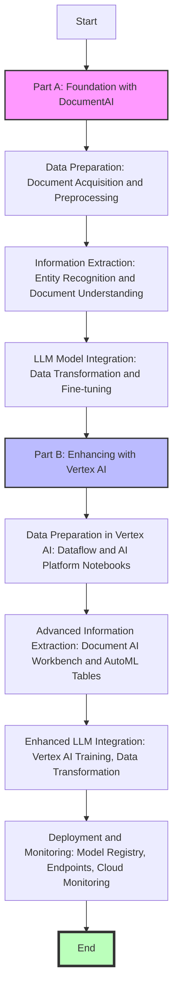

```mermaid
graph TD
    A[Start] --> B[Part A: Foundation with DocumentAI]
    B --> C[Data Preparation: Document Acquisition and Preprocessing]
    C --> D[Information Extraction: Entity Recognition and Document Understanding]
    D --> E[LLM Model Integration: Data Transformation and Fine-tuning]
    E --> F[Part B: Enhancing with Vertex AI]
    F --> G[Data Preparation in Vertex AI: Dataflow and AI Platform Notebooks]
    G --> H[Advanced Information Extraction: Document AI Workbench and AutoML Tables]
    H --> I[Enhanced LLM Integration: Vertex AI Training, Data Transformation]
    I --> J[Deployment and Monitoring: Model Registry, Endpoints, Cloud Monitoring]
    J --> K[End]

    style B fill:#f9f,stroke:#333,stroke-width:2px
    style F fill:#bbf,stroke:#333,stroke-width:2px
    style K fill:#bfb,stroke:#333,stroke-width:4px

```